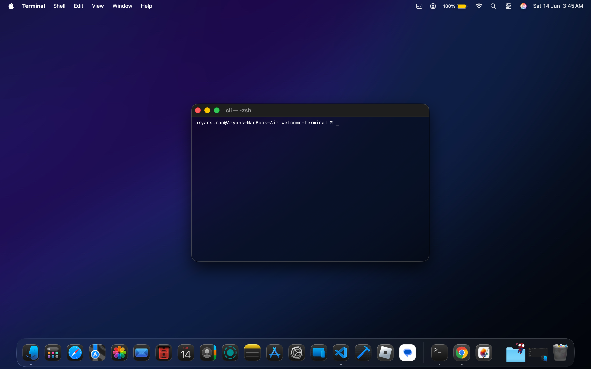
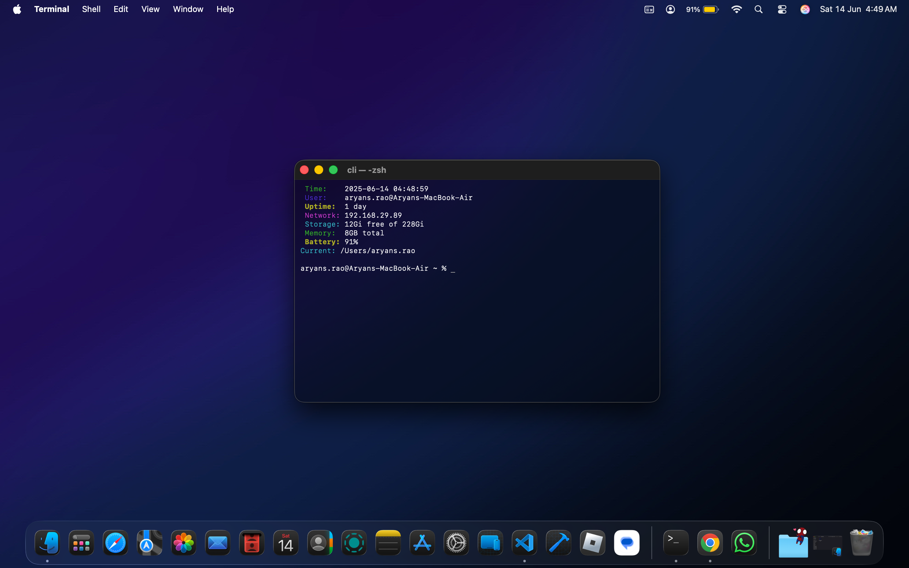

# Terminal Welcome Script

A lightweight, cross-platform terminal welcome script that displays system information every time you open a new terminal session. Compatible with both macOS and Linux systems.

## Features

- **System Information Display**: Shows current time, user, uptime, network IP, storage, memory, and battery status
- **Git Integration**: Displays current branch when in a git repository
- **Cross-Platform**: Works on both macOS and Linux
- **Automatic Execution**: Runs automatically when opening new terminal sessions
- **Manual Command**: Create a custom command for on-demand execution
- **Easy Management**: Simple installation, status checking, and removal

## Before and After

### Your Terminal Without This Script


### Your Terminal With This Script


## Quick Installation

```bash
curl -sSL https://raw.githubusercontent.com/aryansrao/welcome-terminal/main/setup.sh | bash
```

Or clone and run locally:

```bash
git clone https://github.com/aryansrao/welcome-terminal.git
cd welcome-terminal
chmod +x setup.sh
./setup.sh
```

## What Gets Installed

- **Script Location**: `~/.local/bin/welcome.sh`
- **Custom Command**: Creates a command (default: `sysinfo`) for manual execution
- **Shell Integration**: Adds automatic execution to your shell config (`.zshrc` or `.bashrc`)
- **PATH Addition**: Adds `~/.local/bin` to your PATH if not already present

## Usage

### Automatic Execution
The script runs automatically every time you open a new terminal session.

### Manual Execution
Run your custom command anytime:
```bash
sysinfo
```

Or execute the script directly:
```bash
~/.local/bin/welcome.sh
```

## System Information Displayed

- **Time**: Current date and time
- **User**: Username and hostname
- **Uptime**: System uptime
- **Network**: Current IP address
- **Storage**: Available disk space
- **Memory**: Available/total memory
- **Battery**: Battery percentage (if available)
- **Git**: Current branch (when in a git repository)
- **Current Directory**: Present working directory

## Management Commands

### Check Installation Status
```bash
./setup.sh status
```

### Reinstall
```bash
./setup.sh install
```

### Uninstall
```bash
./setup.sh uninstall
```

### Interactive Menu
```bash
./setup.sh
```

## Shell Compatibility

- **macOS**: Automatically detects and configures for Zsh (default shell)
- **Linux**: Configures for Bash or Zsh based on your current shell
- **Configuration Files**: 
  - macOS: `~/.zshrc`
  - Linux: `~/.bashrc` or `~/.zshrc`

## Installation Process

1. **Directory Creation**: Creates `~/.local/bin` directory
2. **Script Installation**: Copies the welcome script to the bin directory
3. **Command Creation**: Creates your custom command name (default: `sysinfo`)
4. **PATH Configuration**: Adds the bin directory to your PATH
5. **Shell Integration**: Configures automatic execution on terminal startup

## Customization

### Change Command Name
During installation, you can specify a custom command name:
```
Command name [sysinfo]: myinfo
```

### Disable Auto-Run
To disable automatic execution while keeping the manual command:
1. Edit your shell config file (`~/.zshrc` or `~/.bashrc`)
2. Comment out or remove the line containing the script path

## Uninstallation

The uninstall process completely removes:
- All script files and command links
- Shell configuration entries
- PATH modifications
- Creates a backup of your shell config

```bash
./setup.sh uninstall
```

## System Requirements

- **Operating Systems**: macOS or Linux
- **Shell**: Bash or Zsh
- **Dependencies**: Standard Unix utilities (available on all systems)

## Platform-Specific Features

### macOS
- Battery percentage via `pmset`
- Memory information via `sysctl`
- Network IP via `ifconfig`

### Linux
- Battery percentage from `/sys/class/power_supply/`
- Memory information via `free`
- Network IP via `hostname -I`

## Troubleshooting

### Script Not Running Automatically
1. Restart your terminal or run `source ~/.zshrc` (or `~/.bashrc`)
2. Check if the script path is in your shell config
3. Verify the script has execute permissions

### Command Not Found
1. Check if `~/.local/bin` is in your PATH: `echo $PATH`
2. Reinstall to fix PATH configuration
3. Use the full path: `~/.local/bin/welcome.sh`

### Permission Issues
```bash
chmod +x ~/.local/bin/welcome.sh
```

## Contributing

Contributions are welcome! Please feel free to submit issues, feature requests, or pull requests.

## License

This project is open source and available under the MIT License.

## Author

Created by [aryansrao](https://github.com/aryansrao)

---

**Note**: This script is designed to be lightweight and fast. All system information calls include error handling to ensure your terminal startup remains smooth even if some system calls fail.
# welcome-terminal
